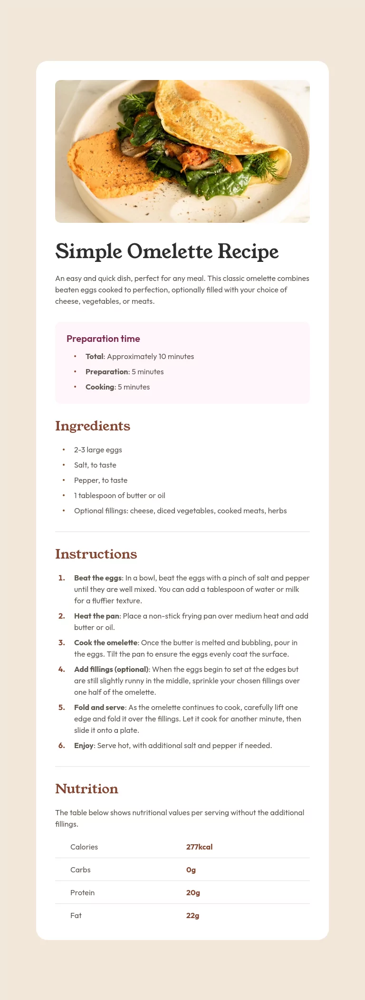

# Frontend Mentor - Recipe page

This is a solution to the [Recipe page challenge on Frontend Mentor](https://www.frontendmentor.io/challenges/recipe-page-KiTsR8QQKm).

## Links

- Solution URL: [GitHub](https://github.com/Michal-Majchrzak/fm-recipe-page)
- Live Site URL: [GitHubPages](https://michal-majchrzak.github.io/fm-recipe-page/)

## Preview

## Built with

- HTML5 markup
- CSS / Flexbox
- Responsive layout
- Mobile-first workflow

## Author

- Frontend Mentor - [@Michal-Majchrzak](https://www.frontendmentor.io/profile/Michal-Majchrzak)